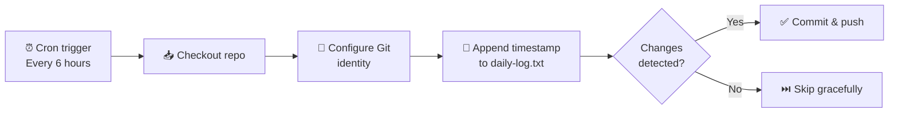

# Automated GitHub Contribution System — Setup & Guide

## Overview

This project uses a GitHub Actions workflow to make **4 commits per day** automatically, keeping your GitHub contribution graph active. The workflow appends a UTC timestamp to `daily-log.txt` every 6 hours (00:00, 06:00, 12:00, 18:00 UTC).

---

## Quick Start

### 1. Push this repository to GitHub

```bash
cd Git-Auto
git init
git add .
git commit -m "feat: add daily auto-commit workflow"
git branch -M main
git remote add origin https://github.com/<YOUR_USERNAME>/Git-Auto.git
git push -u origin main
```

### 2. Enable GitHub Actions (if not already)

1. Go to your repository on GitHub.
2. Click **Settings → Actions → General**.
3. Under **Actions permissions**, select **Allow all actions and reusable workflows**.
4. Click **Save**.

### 3. Allow workflows to push commits

> [!IMPORTANT]
> This step is **required** — without it the workflow will fail with a `403` error on push.

1. Go to **Settings → Actions → General**.
2. Scroll to **Workflow permissions**.
3. Select **Read and write permissions**.
4. Check **Allow GitHub Actions to create and approve pull requests** (optional but recommended).
5. Click **Save**.

### 4. Verify

- Go to the **Actions** tab in your repository.
- Click **Daily Auto-Commit** on the left.
- Click **Run workflow → Run workflow** to trigger it manually.
- After it completes, check `daily-log.txt` for the new timestamp entry.

---

## Customizing the Schedule

The schedule is controlled by the `cron` expression in the workflow file:

```yaml
schedule:
  - cron: "0 */6 * * *"   # current: every 6 hours (4 commits/day)
```

### Common cron patterns

| Schedule | Cron Expression | Commits/Day |
|---|---|---|
| Every day at midnight UTC | `0 0 * * *` | 1 |
| Every 12 hours | `0 0,12 * * *` | 2 |
| Every 8 hours | `0 */8 * * *` | 3 |
| **Every 6 hours (current)** | **`0 */6 * * *`** | **4** |
| Every 4 hours | `0 */4 * * *` | 6 |
| Every 3 hours | `0 */3 * * *` | 8 |
| Weekdays only, every 6 hours | `0 */6 * * 1-5` | 4 (weekdays) |

### Cron field reference

```
┌───────────── minute        (0–59)
│ ┌─────────── hour          (0–23)
│ │ ┌───────── day of month  (1–31)
│ │ │ ┌─────── month         (1–12)
│ │ │ │ ┌───── day of week   (0–6, Sun=0)
│ │ │ │ │
* * * * *
```

> [!NOTE]
> GitHub Actions may delay scheduled runs by **15–60 minutes** under heavy load. This is normal. The contribution is still recorded at the commit's timestamp, not when the workflow actually ran.

---

## Troubleshooting — Commits Not Showing on the Contribution Graph

If the green squares aren't appearing, work through these checks:

### ✅ 1. Commits must be on the **default branch**

GitHub only counts contributions on the default branch (`main` or `master`). Verify:

```bash
git remote show origin | grep "HEAD branch"
```

### ✅ 2. The committer email must be linked to your GitHub account

The workflow uses the GitHub Actions bot email. Commits by bots **do** appear in the repo history but **may not** count toward *your personal* contribution graph.

**Fix — use your own identity instead:**

Replace the Git config step in the workflow:

```yaml
- name: Configure Git credentials
  run: |
    git config user.name  "Your Name"
    git config user.email "your-github-email@example.com"
```

> [!IMPORTANT]
> The email **must** match one of the verified emails in your GitHub account under **Settings → Emails**. Unverified or mismatched emails will not count.

### ✅ 3. The repository must **not** be a fork

GitHub does not count commits in forked repositories toward the contribution graph unless they are merged into the upstream repo via a pull request. Make sure this is a standalone repository.

### ✅ 4. The repository can be private or public

Both private and public repositories count toward the contribution graph, but private contributions are only visible if you enable **"Private contributions"** in your GitHub profile settings.

1. Go to your GitHub profile page.
2. Below the contribution graph, click **Contribution settings**.
3. Check **Private contributions**.

### ✅ 5. Workflow permissions are set correctly

If the push step fails silently, ensure you completed Step 3 of the Quick Start above (read/write workflow permissions).

### ✅ 6. GitHub Actions is not disabled

Go to **Settings → Actions → General** and make sure Actions are allowed.

### ✅ 7. Scheduled workflow went dormant

> [!WARNING]
> GitHub automatically **disables** scheduled workflows in repositories with **no activity for 60 days**. You'll receive an email notification before this happens.

**Fix:** Push any commit, or manually trigger the workflow from the Actions tab. GitHub will re-enable the schedule.

---

## File Structure

```
Git-Auto/
├── .github/
│   └── workflows/
│       └── auto-commit.yml    ← GitHub Actions workflow
├── daily-log.txt              ← Created automatically on first run
└── README.md                  ← This file
```

---

## How It Works



1. **Trigger** — The workflow runs every 6 hours — 4 times per day (or manually).
2. **Checkout** — The repository is cloned into the runner.
3. **Git config** — The bot's identity is set so commits are properly attributed.
4. **Update file** — A UTC timestamp is appended to `daily-log.txt`.
5. **Commit & push** — If there are changes, they're committed and pushed. If not, the workflow exits cleanly without error.

---

## License

This project is provided as-is. Use it however you like.
